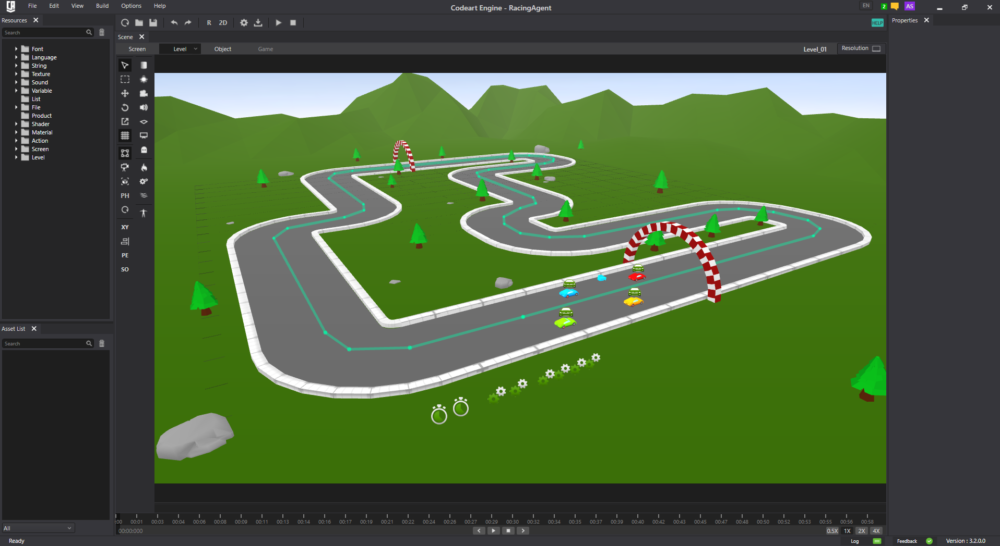

🧠 CodeArt Engine CA3DPlugin

CA3DPlugin is a powerful communication bridge between external applications and the CodeArt Game Engine. Designed for advanced simulation,  
AI development, and real-time control, this plugin enables seamless integration across networks and programming languages—making it ideal for testing autonomous systems, game logic, and intelligent agents.

🚀 Key Features

🔗 Engine Communication Connect external software to the CodeArt Game Engine for real-time data exchange and control.

🌐 Network Integration Supports network-based communication for distributed simulation and remote control.

🧠 AI & Simulation Support Perfect for testing algorithms in:

Self-driving car simulations  
Robotics and intelligent agents  
Game AI and decision systems

- Multi-language Compatibility Interface with CodeArt Engine using various programming languages for flexible integration.

🎮 Game Control & Logic Send commands, receive game state updates, and manipulate in-game entities programmatically.

🛠️ Use Cases  

Autonomous vehicle algorithm testing  
AI behavior simulation in virtual environments  
Game control via external scripts or applications  
Real-time monitoring and feedback loops  

